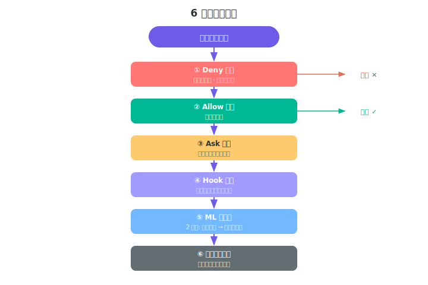
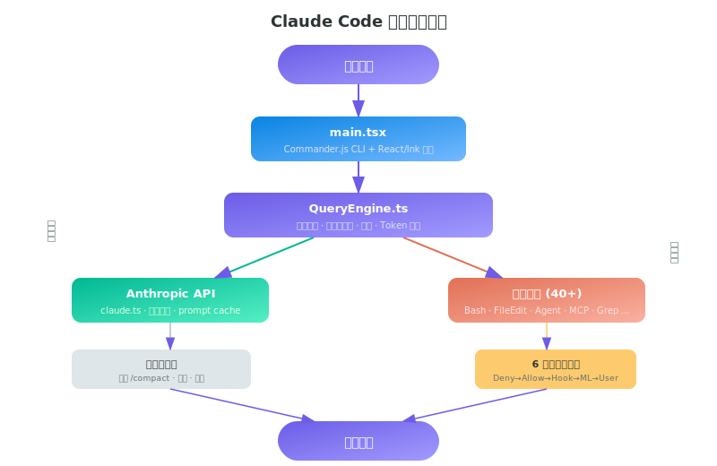

# 第一章 Claude Code 高效使用手册

> **导读｜读完这章能做什么**
> - 配置权限白名单减少 70% 确认弹框
> - 用 Meta+P 快速切模型省钱
> - 用 --json-schema 做 CI 集成

> 从源码中整理的技巧、隐藏命令、高级配置，帮助开发者更高效地使用 Claude Code。

---

## 一、常用但文档未覆盖的 CLI 参数

### 结构化输出：让 Claude Code 返回 JSON

```bash
claude --print "分析这个项目的依赖" \
  --output-format json \
  --json-schema '{"type":"object","properties":{"deps":{"type":"array","items":{"type":"string"}},"risks":{"type":"array"}}}'
```

返回的不是对话文本，而是严格符合 schema 的 JSON。适合写脚本和做 CI 集成。

### Bare 模式：最小化启动

```bash
claude --bare --system-prompt "你是一个 shell 脚本专家"
```

跳过所有自动发现：CLAUDE.md、hooks、LSP、plugins、keychain、auto-memory。启动速度最快，适合在沙盒/CI 中使用。

### 预填充 Prompt（不提交）

```bash
claude --prefill "帮我重构 src/utils/ 下所有"
```

打开交互界面时 prompt 已填好，可以编辑后再提交。适合常用的长 prompt 模板。

### 分叉会话：从断点开始新分支

```bash
claude --resume abc123 --fork-session
```

恢复旧会话但创建新的 session ID——原会话不受影响。适合 "如果我换一种方法" 的探索。

### 文件时间回溯

```bash
claude --resume abc123 --rewind-files user-msg-id
```

恢复会话，**同时把项目文件恢复到那条消息时的状态**。后悔改了某些文件？用这个。

### 流式 JSON 管道

```bash
echo '{"type":"user","content":"list all TODO items"}' | \
  claude --print --input-format stream-json --output-format stream-json
```

标准输入/输出都是 JSON 流——可以和其他工具管道组合。

### 花钱上限

```bash
claude --print "大规模重构" --max-budget-usd 5.00
```

超过 5 美元自动停止。防止失控的 Agent 循环消耗额度。

### 多目录上下文

```bash
claude --add-dir ../shared-libs --add-dir ../docs
```

让 Claude Code 同时看到多个目录的代码——跨仓库工作时需要。

### Worktree + Tmux 一键隔离

```bash
claude --worktree feature-x --tmux
```

自动创建 Git worktree + tmux session，在隔离环境中工作。完成后用 `/exit` 选择保留或删除。

---

## 二、快捷键参考

多数用户只用 Enter 和 Ctrl+C，但 Claude Code 有一套完整的快捷键系统：

### 常用快捷键

| 快捷键 | 功能 | 场景 |
|--------|------|------|
| `Meta+P` | 模型选择器 | 快速切换 opus/sonnet/haiku |
| `Meta+O` | 切换 Fast 模式 | 需要快速响应时 |
| `Meta+T` | 切换思考模式 | 复杂问题开/关深度思考 |
| `Shift+Tab` | 循环权限模式 | 临时切换 ask/accept/bypass |
| `Ctrl+R` | 历史搜索 | 复用之前的 prompt |
| `Ctrl+S` | 暂存消息 | 先暂存当前输入，做别的事 |
| `Ctrl+T` | 切换 Todo 列表 | 查看/管理任务清单 |
| `Ctrl+O` | 切换转录视图 | 查看完整对话 + 工具调用 |
| `Ctrl+X Ctrl+E` | 外部编辑器 | 用 vim/vscode 写长 prompt |
| `Alt+V` (Win) | 粘贴图片 | 直接粘贴截图给 Claude 分析 |
| `Ctrl+L` | 重绘屏幕 | 终端显示乱了时 |
| `Shift+Up` | 消息操作菜单 | 对历史消息执行操作 |

### 确认对话框中的快捷键

| 快捷键 | 功能 |
|--------|------|
| `Y` / `Enter` | 确认 |
| `N` / `Escape` | 拒绝 |
| `Ctrl+E` | 展开/折叠详细解释 |
| `Shift+Tab` | 循环权限模式 |

### 自定义快捷键

编辑 `~/.claude/keybindings.json`：

```json
{
  "keybindings": [
    {
      "context": "Chat",
      "bindings": {
        "ctrl+shift+r": "review",
        "ctrl+shift+t": "test"
      }
    }
  ]
}
```

> **注意：** `Ctrl+C` 和 `Ctrl+D` 不可重绑定（保留给中断和退出）。

---

## 三、CLAUDE.md 高级用法

### 自动发现机制

Claude Code 会**向上递归扫描**所有父目录的 CLAUDE.md：

```
/home/user/projects/my-app/src/  ← 当前目录
/home/user/projects/my-app/CLAUDE.md  ← 加载
/home/user/projects/CLAUDE.md    ← 也加载
/home/user/CLAUDE.md             ← 也加载
```

所以可以在 `~/CLAUDE.md` 放全局偏好，在项目根目录放项目规则。

### 特殊 Section Headers

```markdown
# claude
主要指令和上下文（始终加载）

# claude up
初始化命令（/up 命令触发）

# claude tools
工具特定指令

# claude settings
内联配置（会被解析为 settings）

# claude hooks
Hook 定义（替代 settings.json）

# claude agents
Agent 定义
```

### 外部文件引用

```markdown
<!-- @include ./coding-standards.md -->
<!-- @include ./api-docs.md -->
```

CLAUDE.md 可以引用外部文件——保持主文件简洁，详细内容分文件。

### 禁用 CLAUDE.md 自动发现

```bash
CLAUDE_CODE_DISABLE_CLAUDE_MDS=1 claude
# 或
claude --bare
```

---

## 四、权限配置的实用策略

### 减少重复确认

每次都弹 "Allow Bash(git status)?" 确认框？在 settings.json 中配置一次，之后不再弹窗：

```json
{
  "permissions": {
    "allow": [
      "Bash(git:*)",
      "Bash(npm:test)",
      "Bash(npm:run:*)",
      "Bash(ls:*)",
      "Bash(cat:*)",
      "Bash(find:*)",
      "Bash(grep:*)",
      "Read",
      "Glob",
      "Grep"
    ],
    "deny": [
      "Bash(rm:-rf:*)",
      "Bash(sudo:*)",
      "Bash(chmod:777:*)"
    ]
  }
}
```

<details>
<summary>📋 复制给 Claude，一键配置</summary>

```
帮我配置 Claude Code 权限白名单。在 ~/.claude/settings.json 中设置：allow 规则包括 Read、Glob、Grep、所有 git 命令、npm test、npm run、npx、node、python、ls、cat、head、tail、find、grep、rg、wc、echo、which、env、pwd、date。deny 规则包括 rm -rf、sudo、chmod 777、curl POST、dd。如果文件已存在，合并进去不要覆盖其他配置。
```

</details>

### 权限规则语法

```
"Bash(git:*)"        → 所有 git 命令
"Read(*.ts)"         → 读取所有 .ts 文件
"Edit(src/**/*.tsx)"  → 编辑 src 下所有 .tsx
"Write"              → 所有写操作
"Bash(npm:run:*)"    → 所有 npm scripts
```

### 快速模式切换

在对话中按 `Shift+Tab` 循环切换：
```
default (逐一确认) → acceptEdits (自动接受编辑) → plan (规划模式)
```

或者直接：
```bash
claude --dangerously-skip-permissions  # 完全跳过（仅你信任的项目）
```

权限决策链的完整流程可参考第六章。



---

## 五、Hook 系统：自动化工作流

### 例 1：每次编辑后自动格式化

```json
{
  "hooks": {
    "PostToolUse": [
      {
        "type": "command",
        "command": "prettier --write $CHANGED_FILES",
        "if": "Edit(*)",
        "timeout": 10
      }
    ]
  }
}
```

<details>
<summary>📋 复制给 Claude，一键配置</summary>

```
帮我在 ~/.claude/settings.json 的 hooks.PostToolUse 中添加一个 Hook：每次 Edit 工具执行后，自动运行 prettier --write 格式化被修改的文件。设为异步执行，超时 10 秒。如果 hooks 字段不存在就创建。
```

</details>

### 例 2：每次 Bash 后自动 git add

```json
{
  "hooks": {
    "PostToolUse": [
      {
        "type": "command",
        "command": "git add -A",
        "if": "Bash(git:*)",
        "timeout": 5
      }
    ]
  }
}
```

### 例 3：Agent 验证器——完成后自动跑测试

```json
{
  "hooks": {
    "PostToolUse": [
      {
        "type": "agent",
        "prompt": "Run unit tests and verify all pass. If any fail, explain why.",
        "model": "claude-sonnet-4-6",
        "timeout": 120,
        "if": "Edit(src/**/*)"
      }
    ]
  }
}
```

<details>
<summary>📋 复制给 Claude，一键配置</summary>

```
帮我在 ~/.claude/settings.json 的 hooks.PostToolUse 中添加一个 Agent 类型的 Hook：每次编辑 src/ 目录下的文件后，自动用 claude-sonnet-4-6 模型跑一遍单元测试并验证是否通过。超时 120 秒。
```

</details>

### 例 4：HTTP Webhook 通知

```json
{
  "hooks": {
    "SessionEnd": [
      {
        "type": "http",
        "url": "https://hooks.slack.com/services/YOUR/WEBHOOK",
        "headers": {
          "Content-Type": "application/json"
        },
        "timeout": 5
      }
    ]
  }
}
```

### 所有 Hook 事件 (26 种)

| 事件 | 触发时机 |
|------|----------|
| `Setup` | 初始化/维护 |
| `SessionStart` / `SessionEnd` | 会话开始/结束 |
| `PreToolUse` / `PostToolUse` | 工具执行前/后 |
| `PostToolUseFailure` | 工具执行失败 |
| `UserPromptSubmit` | 用户提交 prompt |
| `PermissionRequest` / `PermissionDenied` | 权限请求/拒绝 |
| `SubagentStart` / `SubagentStop` | 子 Agent 启动/停止 |
| `PreCompact` / `PostCompact` | 压缩前/后 |
| `TaskCreated` / `TaskCompleted` | 任务创建/完成 |
| `FileChanged` | 文件变更 |
| `CwdChanged` | 工作目录变更 |
| `WorktreeCreate` / `WorktreeRemove` | Worktree 创建/删除 |
| `ConfigChange` | 配置变更 |
| `InstructionsLoaded` | 指令加载 |
| `Notification` | 通知 |
| `Stop` / `StopFailure` | 停止/停止失败 |

---

## 六、环境变量参考

### 性能调优

```bash
# 禁用非必要网络流量（隐私模式）
export CLAUDE_CODE_DISABLE_NONESSENTIAL_TRAFFIC=1

# 禁用 prompt caching（调试用）
export DISABLE_PROMPT_CACHING=1

# Bash 工具超时（默认 120秒）
export BASH_MAX_TIMEOUT_MS=300000    # 改为 5 分钟

# 最大并发工具执行数
export CLAUDE_CODE_MAX_TOOL_USE_CONCURRENCY=8

# API 超时
export API_TIMEOUT_MS=60000
```

### 功能开关

```bash
# 禁用自动记忆（不想让它记住东西）
export CLAUDE_CODE_DISABLE_AUTO_MEMORY=1

# 禁用自动压缩（手动 /compact 控制）
export DISABLE_AUTO_COMPACT=1

# 禁用 CLAUDE.md 自动发现
export CLAUDE_CODE_DISABLE_CLAUDE_MDS=1

# 禁用后台任务
export CLAUDE_CODE_DISABLE_BACKGROUND_TASKS=1

# 启用 LSP 工具（代码智能）
export ENABLE_LSP_TOOL=1

# 启用工具搜索
export ENABLE_TOOL_SEARCH=1
```

### 模型配置

```bash
# 全局默认模型
export ANTHROPIC_MODEL=claude-sonnet-4-6

# 子 Agent 用便宜的模型
export ANTHROPIC_SMALL_FAST_MODEL=claude-haiku-4-5-20251001

# 自定义 API 端点（企业代理）
export ANTHROPIC_BASE_URL=https://my-proxy.company.com/v1

# 自定义请求头
export ANTHROPIC_CUSTOM_HEADERS='{"X-Team": "platform"}'
```

### 代理/网络

```bash
# HTTP 代理（小写优先级高于大写）
export https_proxy=http://proxy.company.com:8080
export no_proxy=localhost,127.0.0.1,.company.com

# 让代理做 DNS 解析
export CLAUDE_CODE_PROXY_RESOLVES_HOSTS=1

# 自定义 CA 证书
export NODE_EXTRA_CA_CERTS=/path/to/company-ca.pem
```

### AWS Bedrock / Google Vertex

```bash
# 使用 AWS Bedrock
export CLAUDE_CODE_USE_BEDROCK=1
export AWS_REGION=us-west-2

# 使用 Google Vertex
export CLAUDE_CODE_USE_VERTEX=1
export VERTEX_BASE_URL=https://your-vertex-endpoint
```

---

## 七、模型选择与 Fast 模式

### 三种模型的使用场景

| 模型 | 别名 | 适用场景 | 成本 |
|------|------|----------|------|
| Opus 4.6 | `opus` | 复杂架构、大规模重构 | 最高 |
| Sonnet 4.6 | `sonnet` | 日常编码、Bug 修复 | 中等 |
| Haiku 4.5 | `haiku` | 快速查询、简单任务 | 最低 |

### Fast 模式到底是什么

```bash
claude --fast  # 或会话内 /fast 或 Meta+O
```

**Fast 模式的本质：** 同样是 Opus 4.6 模型，但使用更快的推理通道。代价是按 "extra usage" 计费，有独立的速率限制。

**不可用的情况：**
- 免费 Claude AI 账户
- 组织禁用了 extra usage
- 第三方提供商 (Bedrock/Vertex)
- 非 Opus 模型

### 动态切换模型

对话中任意时刻：
```
/model sonnet    ← 切换到便宜模型做简单任务
/model opus      ← 切回来做复杂任务
```

或者用 `Meta+P` 打开模型选择器。

### Effort 级别

```bash
claude --effort low     # 快速响应，减少思考
claude --effort high    # 深度分析
claude --effort max     # 最大努力
claude --effort auto    # 模型自己判断
```

也可以对话中：`/effort high`

---

## 八、会话管理技巧

### 给会话命名（方便找回）

```bash
claude --name "重构认证模块"
# 或对话中
/rename "重构认证模块"
```

之后 `/resume` 时可以搜索 "认证" 找到。

### 从 PR 恢复会话

```bash
claude --from-pr 123       # PR 号
claude --from-pr https://github.com/org/repo/pull/123  # URL
```

自动恢复与该 PR 关联的最新会话。

### 导出对话

```
/export   # 导出当前会话为文件
/share    # 分享会话链接
```

### /compact 的高级用法

```
/compact                                # 默认摘要
/compact "只保留架构决策和 API 设计"      # 自定义摘要指令
/compact "用中文总结，重点保留代码片段"    # 指定语言和重点
```

> **技巧：** 当上下文快满时，用自定义指令 compact 可以精确控制保留什么。

---

## 九、MCP 服务器：扩展 Claude Code 的能力

### 查看已连接的 MCP 服务器

```
/mcp
```

### 添加自定义 MCP 服务器

**方式 1：CLI 参数**
```bash
claude --mcp-config '{"servers":{"my-db":{"command":"npx","args":["mcp-server-postgres","postgresql://..."]}}}'
```

**方式 2：配置文件** (`~/.claude/mcp-servers.json`)
```json
{
  "my-db": {
    "command": "npx",
    "args": ["mcp-server-postgres", "postgresql://localhost/mydb"]
  },
  "filesystem": {
    "command": "npx",
    "args": ["@anthropic-ai/mcp-server-filesystem", "/path/to/allowed"]
  }
}
```

**方式 3：从 Claude Desktop 导入**
```bash
claude mcp add-from-claude-desktop
```

### 严格 MCP 模式

```bash
claude --strict-mcp-config --mcp-config my-servers.json
```

只使用指定的 MCP 服务器，忽略所有其他配置。

---

## 十、自定义 Agent 类型

### 在项目中定义

创建 `.claude/agents/reviewer.md`：

```markdown
---
name: reviewer
description: 代码审查专家，只读不写
tools: [Read, Glob, Grep]
model: claude-sonnet-4-6
effort: thorough
permissionMode: acceptEdits
memory: project
maxTurns: 50
---
你是一个代码审查专家。规则：
1. 永远不要修改文件
2. 关注安全漏洞、性能问题、可维护性
3. 用表格总结发现
4. 严重程度分级：Critical / Warning / Info
```

使用：对话中 Claude Code 会自动发现并在 Agent 工具中提供 `reviewer` 类型。

多 Agent 的编排模式和协作机制可参考第三章中的架构说明。


### 全局 Agent（跨项目）

放在 `~/.claude/agents/` 下，所有项目都可用。

### CLI 直接定义

```bash
claude --agents '{"quick-check":{"description":"快速检查","prompt":"用最少的步骤检查代码健康度"}}'
```

---

## 十一、输出风格定制

### 内置风格

| 风格 | 特点 |
|------|------|
| `default` | 标准输出 |
| `Explanatory` | 教学模式，解释每一步 |
| `Learning` | 练习模式，"Learn by Doing" |

切换：`/config` → Output Style

### 自定义风格

创建 `~/.claude/output-styles/concise.md`：

```markdown
---
name: concise
description: 精简输出，不解释，只给代码
---
规则：
1. 不要解释代码做了什么
2. 不要给出替代方案
3. 直接输出代码/命令
4. 如果是代码修改，只显示 diff
5. 回复控制在 3 行以内（除非是代码块）
```

---

## 十二、调试与诊断

### /doctor 命令

```
/doctor
```

自动检查：安装完整性、设置有效性、认证状态、API 连通性、权限配置、Hook 状态、插件状态、MCP 服务器。

### Debug 模式

```bash
claude --debug "*"                # 所有 debug 信息
claude --debug "api,hooks"        # 只看 API 和 Hooks
claude --debug "!file,!1p"        # 排除特定类别
claude --debug-file debug.log     # 写入文件（不影响终端）
```

### 查看上下文使用情况

```
/context
```

显示彩色网格，直观展示 Token 使用分布：system prompt、对话历史、工具结果各占多少。

### 查看成本

```
/cost
```

显示当前会话的总费用、总时长、按模型分的 Token 用量。

### 性能分析

```bash
export CLAUDE_CODE_PROFILE_STARTUP=1   # 启动性能分析
export CLAUDE_CODE_PROFILE_QUERY=1     # 查询性能分析
```

---

## 十三、CI/CD 集成模式

### Print 模式：脚本友好

```bash
# 代码审查 CI
result=$(claude --print "Review this PR for security issues" \
  --output-format json \
  --max-turns 5 \
  --max-budget-usd 1.00)

# 解析 JSON 输出
echo "$result" | jq '.result'
```

### 流式输出 + Hook 事件

```bash
claude --print "Run full test suite" \
  --output-format stream-json \
  --include-hook-events \
  --include-partial-messages
```

实时流式获取每一个工具调用、Hook 执行、部分消息。

### 结构化输出用于自动化

```bash
claude --print "分析 package.json 的所有依赖" \
  --output-format json \
  --json-schema '{
    "type": "object",
    "properties": {
      "outdated": {"type": "array"},
      "vulnerable": {"type": "array"},
      "unused": {"type": "array"}
    }
  }'
```

### 不保存会话（CI 专用）

```bash
claude --print "task" --no-session-persistence
```

---

## 十四、隐藏功能

### /good-claude

```
/good-claude
```

给 Claude 正向反馈的命令——源码暗示可能用于 RLHF 数据收集。

### /btw

```
/btw 顺便说一下，我更喜欢 tabs 而不是 spaces
```

快速旁注命令，不影响当前任务流。

### Buddy 伴侣精灵

源码中有完整的终端伴侣/宠物系统 (`src/buddy/`)：
- `CompanionSprite.tsx` — 精灵渲染
- `sprites.ts` — 精灵图形定义
- `useBuddyNotification.tsx` — 通知

Feature flag `BUDDY` 控制开关。

### Vim 模式

```
/vim
```

真正的 Vim 模式——Escape 切换 INSERT/NORMAL，支持 hjkl 导航。

---

## 十五、推荐配置模板

把这些放在 `~/.claude/settings.json` 里：

```json
{
  "model": "sonnet",
  "effort": "auto",
  "permissions": {
    "allow": [
      "Read", "Glob", "Grep",
      "Bash(git:*)", "Bash(npm:test)", "Bash(npm:run:*)",
      "Bash(ls:*)", "Bash(cat:*)", "Bash(find:*)",
      "Bash(grep:*)", "Bash(rg:*)",
      "Bash(node:*)", "Bash(python:*)",
      "Bash(echo:*)", "Bash(which:*)", "Bash(env:*)"
    ],
    "deny": [
      "Bash(rm:-rf:*)", "Bash(sudo:*)",
      "Bash(chmod:777:*)", "Bash(curl:*:POST:*)"
    ]
  },
  "hooks": {
    "PostToolUse": [
      {
        "type": "command",
        "command": "prettier --write --ignore-unknown $CHANGED_FILES 2>/dev/null || true",
        "if": "Edit(*)",
        "timeout": 10,
        "async": true
      }
    ]
  },
  "enableAutoMemory": true
}
```

加上 `~/CLAUDE.md`：

```markdown
# claude
- 我是全栈开发者，主要使用 TypeScript + React + Node.js
- 偏好函数式编程风格
- 测试框架用 vitest
- 不要给我加 JSDoc 注释除非我要求
- commit message 用中文
- 重要决策先说方案再执行
```

**效果：** 常见读取/搜索/git 操作无需确认，格式化自动运行，记忆跨会话保留，个人偏好始终生效。

<details>
<summary>📋 复制给 Claude，一键配置</summary>

```
帮我做 Claude Code 项目初始化：1) 在项目根目录创建 CLAUDE.md，内容包括项目语言、框架、测试工具、格式化工具，以及工作规则（先读后改、一次做一件事、报错先分析不重试）。2) 创建 .claude/settings.json 配置权限白名单。3) 创建 .claude/agents/reviewer.md 定义一个只读代码审查 Agent。请先问我项目用什么语言和框架。
```

</details>

下图展示了 Claude Code 的整体架构，便于理解上述配置项如何与各子系统关联：



---

## 总结：提高效率的 10 个方向

| 排名 | 技巧 | 说明 |
|------|------|------|
| 1 | 权限白名单配置 | 减少 70%+ 确认弹框 |
| 2 | `Meta+P` / `Meta+O` 快速切模型 | 按需在成本与速度间切换 |
| 3 | `/compact "自定义指令"` | 精确控制上下文保留内容 |
| 4 | `--print --json-schema` | CI/CD 集成 |
| 5 | CLAUDE.md 层级自动发现 | 全局偏好 + 项目规则自动加载 |
| 6 | PostToolUse Hook 自动格式化 | 代码质量自动保证 |
| 7 | `--worktree --tmux` | 一键隔离实验环境 |
| 8 | `--resume --fork-session` | 不影响原会话地探索不同方案 |
| 9 | 自定义 Agent 类型 | 专用 Agent 一次配置长期可用 |
| 10 | `Ctrl+X Ctrl+E` 外部编辑器 | 复杂 prompt 用 vim/vscode 编写 |
