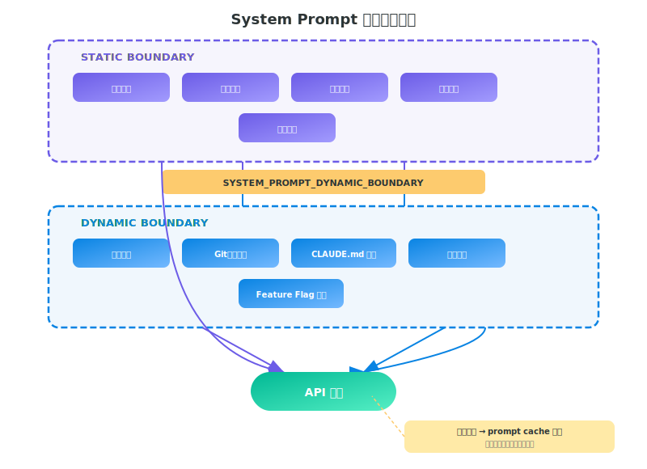
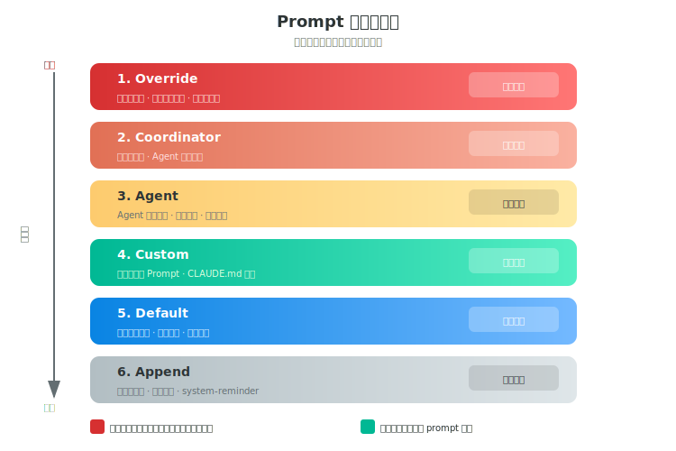

# 第四章 System Prompt 工程

> **导读｜读完这章能做什么**
> - 直接复用 7 条 prompt 策略到自己的 Agent
> - 用正反示例检查自己的 prompt 有没有踩坑
> - 参考动态组装实现 prompt cache 命中

> Claude Code 的 system prompt 是 Anthropic 投入大量调优工作的产物。理解它的结构和策略，对构建 AI Agent 有直接参考价值。

## Prompt 身份定义

```
默认模式:
  "You are Claude Code, Anthropic's official CLI for Claude."

SDK Agent 模式 (非交互 + append):
  "You are Claude Code, Anthropic's official CLI for Claude,
   running within the Claude Agent SDK."

纯 Agent 模式:
  "You are a Claude agent, built on Anthropic's Claude Agent SDK."
```

## 动态 Prompt 组装架构

System Prompt 不是一个静态字符串，而是由多个**缓存段**动态拼装:



关键设计: `SYSTEM_PROMPT_DYNAMIC_BOUNDARY` 标记分隔静态与动态内容，使 Anthropic API 的 **prompt caching** 能缓存静态部分。

## Prompt 优先级系统



| 优先级 | 类型 | 说明 |
|--------|------|------|
| 1 (最高) | Override Prompt | 完全替换所有默认 prompt |
| 2 | Coordinator Prompt | 多 Agent 编排模式 |
| 3 | Agent Prompt | 专用 Agent / Proactive 模式附加 |
| 4 | Custom Prompt | CLI `--prompt` 参数 |
| 5 | Default Prompt | 默认 prompt |
| 6 | Append Prompt | 始终附加 (Override 除外) |

---

## 核心 Prompt 策略分析

### 策略 1: 强调"先读后改"

```
"Do not propose changes to code you haven't read."
"If a user asks about or wants you to modify a file, read it first."
"Understand existing code before suggesting modifications."
```

> **分析:** 通过 prompt 约束 LLM 的 "幻觉式编码"——强制模型在修改前建立完整上下文。

**正反示例:**

| | 场景 | Agent 行为 |
|---|------|-----------|
| **应该** | 用户说"把 utils.ts 里的 formatDate 改成 ISO 格式" | 先 `Read utils.ts` → 找到 `formatDate` → 理解现有逻辑 → 再 `Edit` |
| **不应该** | 同上 | 直接写一个新的 `formatDate` 函数覆盖上去，没看过原来的参数和调用方 |
| **应该** | 用户说"修复登录 bug" | 先 `Grep "login"` → `Read` 相关文件 → 理解上下文 → 再改 |
| **不应该** | 同上 | 凭猜测直接写一段登录修复代码 |

### 策略 2: 抑制过度工程

```
"Avoid over-engineering. Only make changes that are directly requested."
"Don't add features, refactor code, or make 'improvements' beyond what was asked."
"Don't add docstrings, comments, or type annotations to code you didn't change."
"Three similar lines of code is better than a premature abstraction."
```

> **分析:** Anthropic 观察到 LLM 有过度工程化的倾向 (加注释、加类型、提取函数)，用 prompt 显式抑制。

**正反示例:**

| | 用户要求 | Agent 行为 |
|---|---------|-----------|
| **应该** | "把 `var` 改成 `const`" | 只改 `var` → `const`，其他不动 |
| **不应该** | 同上 | 改完 `var` 后顺便加了 JSDoc 注释、提取了一个 helper 函数、加了 TypeScript 类型 |
| **应该** | "加一个删除用户的 API" | 写一个 `deleteUser` 接口，结束 |
| **不应该** | 同上 | 写了 `deleteUser` + 软删除机制 + 审计日志 + 批量删除 + 回收站功能 |
| **应该** | 三个地方有相似的 5 行代码 | 保留三处重复 |
| **不应该** | 同上 | 提取一个 `useCommonLogic()` 抽象（用户没要求） |

<div style="background:#1a1a2e;border-left:4px solid #f9ca24;border-radius:0 8px 8px 0;padding:14px 18px;margin:16px 0">
<strong style="color:#f9ca24;font-size:14px">📋 粘贴给 Claude Code</strong><br>
<span style="color:#a0a0b0;font-size:12px">复制下方内容 → 粘贴到 Claude Code 终端 → 自动完成配置</span>
</div>

```
在项目根目录的 CLAUDE.md 中追加以下工作规则（如果文件不存在就创建）：
- 不要给没改过的代码加注释或类型标注
- 不要在被要求的修改之外做额外重构
- 三行重复代码比过早抽象好
- 一次只做被要求的一件事，做完再做下一件
```

### 策略 3: 安全操作的确认机制

```
"For actions that are hard to reverse, affect shared systems,
 or could be risky, check with the user before proceeding."
"A user approving an action once does NOT mean
 they approve it in all contexts."
"Authorization stands for the scope specified, not beyond."
```

> **分析:** 权限不是二元的。一次授权不等于永久授权——防止 Agent 越权的关键设计。

**正反示例:**

| | 场景 | Agent 行为 |
|---|------|-----------|
| **应该** | 用户批准了 `git push origin feature` | 只 push 这一次。下次 push 再问 |
| **不应该** | 同上 | 认为"用户允许 push 了"，后续直接 `git push --force origin main` |
| **应该** | 要执行 `rm -rf node_modules` | 先告诉用户要删什么、为什么，等确认 |
| **不应该** | 同上 | 直接执行，因为"只是删 node_modules 而已" |
| **应该** | 发现 merge conflict | 展示冲突内容，让用户决定怎么解决 |
| **不应该** | 同上 | 直接 `git checkout --theirs .` 丢弃用户的修改 |

### 策略 4: 不给时间估计

```
"Avoid giving time estimates or predictions for how long tasks will take."
```

> **分析:** LLM 无法准确估时，不说比说错好。

**正反示例:**

| | 用户问 | Agent 回答 |
|---|-------|-----------|
| **应该** | "这个重构要多久？" | "需要改 12 个文件，我先列出改动清单。" |
| **不应该** | 同上 | "大概需要 30 分钟。" |
| **应该** | "这个项目复杂吗？" | "src/ 下有 200 个文件，核心逻辑在 engine/ 的 8 个文件里。" |
| **不应该** | 同上 | "中等复杂度，预计 2-3 天完成。" |

### 策略 5: 安全编码意识

```
"Be careful not to introduce security vulnerabilities such as
 command injection, XSS, SQL injection, and other OWASP top 10
 vulnerabilities."
```

### 策略 5½: 安全编码正反示例

| | 场景 | Agent 行为 |
|---|------|-----------|
| **应该** | 拼接 SQL 查询 | 使用参数化查询 `db.query("SELECT * FROM users WHERE id = ?", [id])` |
| **不应该** | 同上 | `db.query("SELECT * FROM users WHERE id = " + id)` |
| **应该** | 渲染用户输入到 HTML | `textContent = userInput` 或转义 |
| **不应该** | 同上 | `innerHTML = userInput`（XSS） |

### 策略 6: 不暴力重试

```
"If your approach is blocked, do not attempt to brute force
 your way to the outcome."
```

> **分析:** LLM Agent 常见反模式——遇到错误就无脑重试。Prompt 明确禁止这种行为。

**正反示例:**

| | 场景 | Agent 行为 |
|---|------|-----------|
| **应该** | `npm install` 报错 | 读错误信息 → 发现是 Node 版本不对 → 用 `nvm use 20` → 再装 |
| **不应该** | 同上 | 连续跑 3 次 `npm install`，每次都报同样的错 |
| **应该** | API 返回 403 | 停下来告诉用户"权限不够，需要 XXX token" |
| **不应该** | 同上 | `sleep 5` 后重试，再 `sleep 10` 再重试，循环 5 次 |
| **应该** | 文件锁导致写入失败 | 检查什么进程持有锁，告诉用户 |
| **不应该** | 同上 | 直接删除锁文件 |

### 策略 7: 避免向后兼容 Hack

```
"Avoid backwards-compatibility hacks like renaming unused _vars,
 re-exporting types, adding // removed comments for removed code."
```

**正反示例:**

| | 场景 | Agent 行为 |
|---|------|-----------|
| **应该** | 删除了 `formatCurrency()` 函数 | 直接删除，不留痕迹 |
| **不应该** | 同上 | `// removed: formatCurrency()` 或 `const _formatCurrency = null` |
| **应该** | 不再使用 `UserType` 类型 | 删除定义和所有 import |
| **不应该** | 同上 | `export type { UserType } // 保留向后兼容` |

---

## 上下文收集: context.ts

```typescript
getSystemContext()  // Git 状态快照 (memoized, 会话内不更新)
getUserContext()    // CLAUDE.md + 记忆文件 (自动发现、缓存)
```

关键实现细节:
- Git 状态在会话开始时快照，**整个会话期间不会更新**
- 状态文本限制 `MAX_STATUS_CHARS = 2000` 字符，超出截断并警告
- CCR (Cloud Remote) 模式下跳过 git 状态获取

---

## 记忆指令

```
"MEMORY.md is always loaded into your conversation context
 — lines after 200 will be truncated, so keep it concise"

"Create separate topic files for detailed notes
 and link from MEMORY.md"

"Update or remove memories that turn out to be wrong or outdated"
```

### 记忆分类法

| 类型 | 隐私 | 用途 |
|------|------|------|
| `user` | 始终私有 | 用户角色、目标、偏好 |
| `feedback` | 默认私有 | 方法指导 |
| `project` | 私有或团队 | 进行中的工作、目标 |
| `reference` | 通常团队 | 外部系统指针 (Linear, Slack) |

### 记忆漂移警告

```
"Memories are snapshots — must verify against current state before acting"
"Read before recommending from memory (check files exist, grep functions)"
```

> **分析:** 记忆可能过期，prompt 要求模型在使用记忆前先验证当前状态。
