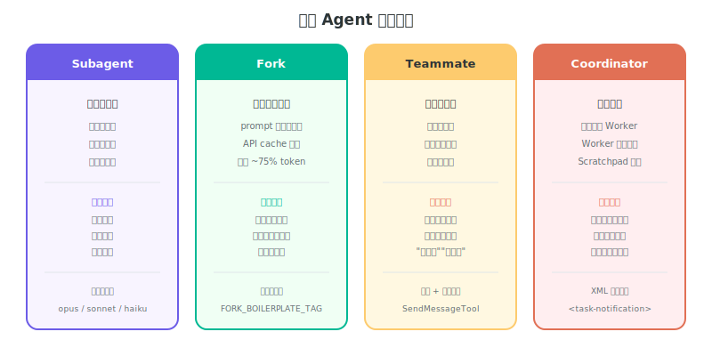
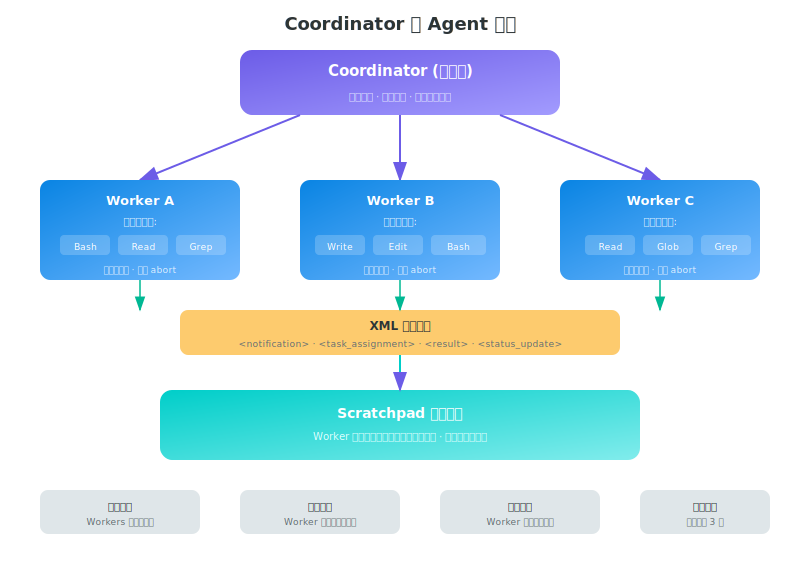

# 第七章：多智能体协作系统

## 四种 Agent 模式



### 1. 子 Agent (Subagent)

- **触发**: `AgentTool` 调用
- **特点**: 一次性任务，完成即销毁
- **类型**: 通过 `loadAgentsDir.ts` 动态加载
- **隔离**: 独立上下文，不共享状态
- **模型**: 可覆盖 (sonnet / opus / haiku)

### 2. Fork Agent (Feature: FORK_SUBAGENT)

- **触发**: `subagent_type` 未指定时隐式 fork
- **特点**: 子 Agent 继承父的**完整上下文和 system prompt**
- **优化**: 字节级相同的 fork children → **prompt cache 共享**
- **防护**: `FORK_BOILERPLATE_TAG` 防止递归 fork
- **结果**: 立即返回占位符 `'Fork started — processing in background'`

> **设计要点:** Fork Agent 的 prompt 与父完全一致，因此 Anthropic API 的 prompt cache 可以命中，无需为子 Agent 重新编译 system prompt，从而节省 Token 和延迟。

### 3. 团队 Agent (Team)

- **触发**: `TeamCreateTool` / `TeamDeleteTool`
- **特点**: 持久化 Agent 组，带角色定义
- **协作**: 通过 `SendMessageTool` 通信
- **生命周期**: 跨多个任务存在

### 4. Coordinator 模式 (Feature: COORDINATOR_MODE)

- **触发**: Feature flag + 环境变量
- **特点**: 中央编排器管理多个 Worker
- **工具限制**: Worker 只能用 Bash、文件操作、Agent、消息发送
- **共享目录**: Scratchpad 用于 Agent 间协作

---

## Coordinator 模式详解

### 架构



### Worker 工具集 (受限)

| 允许 | 禁止 |
|------|------|
| Bash | 直接终端访问 |
| 文件读/写/编辑 | 用户交互对话框 |
| Agent (嵌套) | 完整 UI 组件 |
| 消息发送 | 部分高权限工具 |

### 隐藏内部工具 (仅 Coordinator 可用)

- `TeamCreate` — 创建 Agent 团队
- `TeamDelete` — 删除 Agent 团队
- `SendMessage` — Agent 间消息
- `SyntheticOutput` — 结构化输出

---

## Agent 记忆系统

### 三个记忆作用域

| 作用域 | 位置 | 用途 |
|--------|------|------|
| `user` | `~/.claude/agent-memory/` | 用户级 Agent 记忆 |
| `project` | `.claude/agent-memory/` | 项目级 Agent 记忆 |
| `local` | `.claude/agent-memory-local/` | 本地专用记忆 |

### 远程记忆
- 环境变量: `CLAUDE_CODE_REMOTE_MEMORY_DIR`
- 支持远程存储的 Agent 记忆

### 记忆附件
- Agent 生成时附带相关记忆快照
- 嵌套 Agent 记忆去重
- 类型名消毒处理 (冒号 → 破折号，用于插件 Agent)

---

## 任务系统 (后台执行)

### 任务类型

| 类型 | 说明 |
|------|------|
| `local_bash` | 本地 Shell 命令 |
| `local_agent` | 本地后台 Agent |
| `remote_agent` | CCR 远程执行 |
| `in_process_teammate` | 共享状态 Agent |
| `local_workflow` | 工作流脚本 |
| `monitor_mcp` | MCP 服务器健康检查 |
| `dream` | 主动式工作 (Proactive) |

### 任务生命周期

```typescript
{
  id: string,
  type: TaskType,
  status: 'pending' | 'running' | 'completed' | 'failed' | 'killed',
  description: string,
  startTime: number,
  endTime?: number,
  outputFile: string,      // 输出存储路径
  notified: boolean        // 完成通知状态
}
```

### 关键操作
- `registerForeground()` — 注册为主 Agent 焦点
- `spawnShellTask()` — 创建后台任务
- `backgroundExistingForegroundTask()` — 超时后自动转后台

---

## 设计要点

1. **Fork Agent 的 Cache 共享** — 通过保持 prompt 完全一致来复用 API cache
2. **Worker 工具集限制** — 防止后台 Agent 执行高风险操作
3. **Scratchpad 共享目录** — 解决 Agent 间数据交换问题，比消息传递更高效
4. **任务自动转后台** — 解决长时间运行任务阻塞用户交互的问题
5. **记忆作用域分离** — 让不同级别的 Agent 记忆互不干扰
