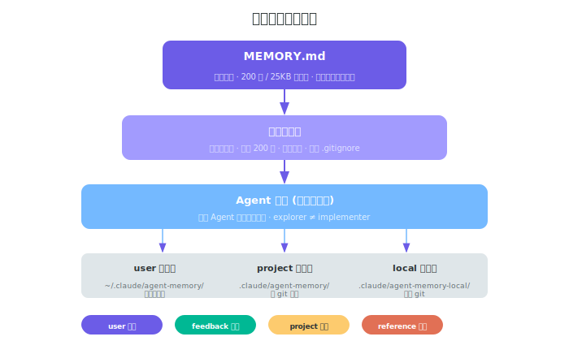

# 第八章：记忆系统与上下文管理

> **导读｜读完这章能做什么**
> - 配置 MEMORY.md 实现跨会话记忆
> - 用 /compact 自定义指令精确控制上下文
> - 理解三级记忆架构和漂移保护机制

## 记忆系统: memdir/

Claude Code 的持久化记忆是其跨会话保持一致性的基础。



### 入口文件: MEMORY.md

- **始终加载**到会话上下文
- **硬限制**: 200 行 / 25KB
- 超出部分被截断 (模型会收到截断警告)
- 设计意图: MEMORY.md 是索引，详细内容放在子文件中

### 扫描记忆文件

- 从 `~/.claude/` 和项目 `.claude/` 目录递归扫描
- **最多 200 个文件**
- **按修改时间排序** (最新优先)
- 遵守 `.gitignore` 规则

### 记忆分类法 (Taxonomy)

每个记忆文件有 YAML frontmatter:

```yaml
---
type: user | feedback | project | reference
name: "记忆名称"
description: "简要描述"
---
```

| 类型 | 隐私级别 | 内容 | 示例 |
|------|----------|------|------|
| `user` | 始终私有 | 角色、目标、偏好 | "我偏好用 Rust" |
| `feedback` | 默认私有 | 方法指导、风格 | "不要用 var，用 const" |
| `project` | 私有或团队 | 工作、目标、事件 | "Q2: 迁移 v2 API" |
| `reference` | 通常团队 | 外部系统指针 | "Linear 看板: xxx" |

### 自动记忆提取 (Feature: EXTRACT_MEMORIES)

- 会话结束时自动从对话中提取值得记住的信息
- 不需要用户主动要求"记住这个"
- Feature flag 控制开关

### 团队记忆同步 (Feature: TEAMMEM)

- `services/teamMemorySync/` — 团队级记忆同步
- 多个用户共享项目记忆
- 支持冲突解决

### 记忆漂移保护

System prompt 中明确警告:

```
"Memories are snapshots — must verify against current state"
"Read before recommending from memory"
"Recent/current state prefers git log and code over memory snapshots"
```

> **注意:** 记忆可能过期。模型在使用记忆前必须先验证当前状态。

---

## 上下文管理

### 系统上下文 (context.ts)

```typescript
getSystemContext()
// 返回: Git 分支名、状态、最近 commits、当前日期
// 特点: 会话开始时快照, 整个会话期间不更新

getUserContext()
// 返回: CLAUDE.md 内容、扫描到的记忆文件
// 特点: 自动发现并缓存
```

### 关键设计: Git 状态不更新

Git 状态在会话开始时获取一次，**整个会话期间不会重新获取**。

- **原因**: 避免昂贵的重复计算 + cache 失效
- **限制**: `MAX_STATUS_CHARS = 2000` 字符
- **缓解**: 用户可手动执行 git 命令获取最新状态

---

## 上下文压缩 (Compaction)

当上下文超过 Token 阈值时触发:

```
对话消息
  → 检测 Token 用量
    → 超过阈值
      → 调用 compact 服务
        → AI 摘要历史对话
        → 替换历史消息为摘要
        → 保留工具结果引用
```

**三种压缩模式:**

| 模式 | 触发 | 机制 |
|------|------|------|
| 手动压缩 | `/compact` 命令 | 用户主动触发 |
| 自动压缩 | Token 超阈值 | AI 摘要历史，替换旧消息 |
| 增量压缩 | Feature: CACHED_MICROCOMPACT | 只压缩新增部分 |

---

## Token 预算管理

### tokenBudget.ts

```typescript
{
  threshold_90_percent: boolean,  // 90% 用量警告
  diminishing_returns: number,    // 500 token 边际收益阈值
  continuation_count: number,     // 继续次数追踪
  turn_tokens: number,            // 当前轮 Token 用量
}
```

- 接近预算上限时发送"继续提示"消息 (nudge)
- 检测边际收益递减 (500 token 阈值)
- 完成事件记录指标

### Token 估算 (tokenEstimation.ts)

- 预估每轮 Token 消耗
- 区分 cache read/creation tokens
- 支持模型: claude-opus-4-6, claude-sonnet-4-6, claude-haiku-4-5

---

## 工具结果持久化

### 大结果磁盘存储

```
工具返回大结果
  → 超过 maxResultSizeChars
    → 保存到 ~/.claude/tool-results/
    → API 只收到摘要 + 文件路径
    → 内容哈希去重
```

### 会话级预算追踪
- 跟踪哪些内容已持久化到磁盘
- 跟踪哪些内容仍在 API 消息中
- 内容替换状态管理

---

## System Prompt 缓存策略

```
静态段 (全局可缓存):
  → 身份声明、工具指南、安全规则、编码规范
  → 所有用户共享，API 缓存命中率高

动态段 (用户特定):
  → 日期、Git 状态、CLAUDE.md、工具列表
  → 每个用户/会话不同

分隔: SYSTEM_PROMPT_DYNAMIC_BOUNDARY
```

### 缓存失效触发
- `/clear` 命令清除所有缓存
- `/compact` 命令清除部分缓存
- `setSystemPromptInjection()` 用于调试

---

## 设计要点

1. **200 行 MEMORY.md 限制** — 强制保持简洁，详细内容放子文件
2. **Git 状态不更新** — 性能与一致性的权衡
3. **自动记忆提取** — 降低用户记忆管理的认知负担
4. **记忆漂移保护** — prompt 级别的自我纠错机制
5. **分层压缩** — 从手动到自动到增量，逐步优化
