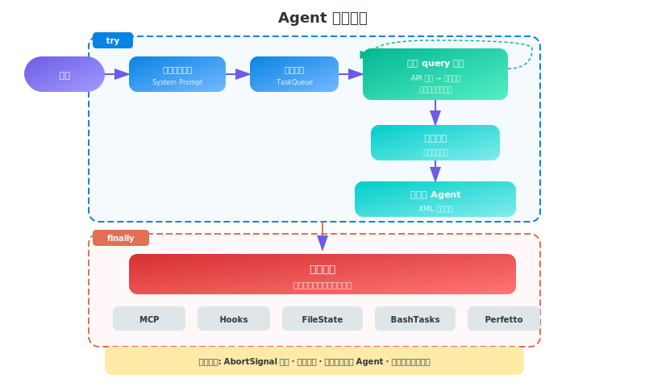
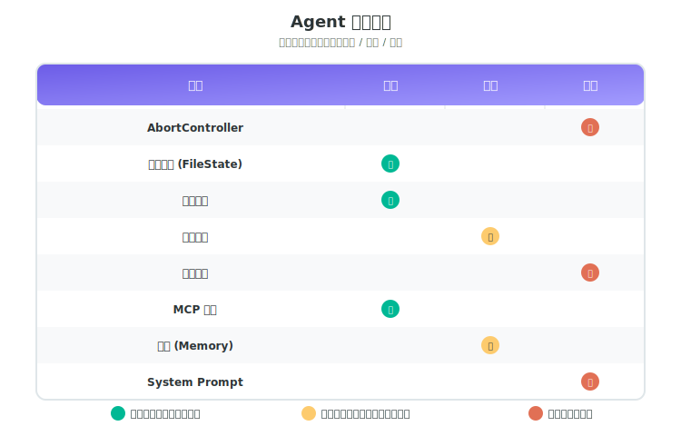
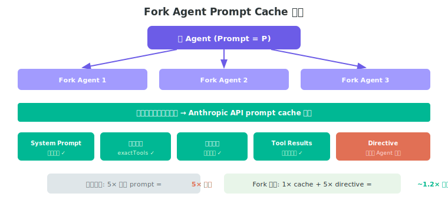

# 第十二章：多 Agent 系统设计启示录

> 本章从 Claude Code 的源码中提炼多 Agent 设计的工程启示。
> 重点不在"Claude Code 怎么做的"，而在"构建类似系统时该怎么做"。

Claude Code 是目前公开可见的较为成熟的生产级多 Agent 系统之一。它在真实产品环境中被大量开发者日常使用。从它的源码中，可以提炼出一套系统性的多 Agent 设计方法论。

---

## 核心认知：多 Agent 不是一个功能，而是一个架构

Claude Code 的多 Agent 不是后加的"子 Agent 调用"功能。它渗透在整个架构中：

- **Task 系统**管理 Agent 生命周期
- **权限系统**理解 Agent 层级
- **记忆系统**支持 Agent 级隔离
- **通信系统**支持多种 Agent 间交互模式
- **UI 系统**展示 Agent 并行状态

**启示 1：如果你打算做多 Agent，从第一天就把它当作架构决策，而不是后加功能。**

---

## 一、Agent 生命周期设计

### Claude Code 怎么做

每个 Agent 经历清晰的生命周期：



**资源清理清单** (来自 `runAgent.ts` 的 finally 块)：
1. 关闭 Agent 独占的 MCP 服务器连接
2. 注销会话级 hooks
3. 释放文件状态缓存
4. 停止性能追踪 (Perfetto)
5. 清理后台 Bash 任务
6. 写入 sidechain 转录文件

### 设计启示

**启示 2：Agent 是资源持有者，必须有显式的清理机制。**

多 Agent 系统最常见的 bug 是资源泄漏——子 Agent 死了但它持有的文件锁/网络连接/后台进程没释放。Claude Code 用 `try/finally` 确保清理：

```typescript
try {
  // Agent 执行循环
  yield* query(...)
} finally {
  // 无论成功/失败/取消，都执行清理
  cleanup(mcpServers, hooks, fileState, bashTasks, perfetto)
}
```

**你的 Agent 框架应该：**
- 每个 Agent 有注册表记录它持有的资源
- Agent 终止时（无论原因）自动遍历注册表清理
- 父 Agent 能强制清理子 Agent 的资源

---

## 二、隔离模型：共享什么、隔离什么

### Claude Code 的隔离矩阵

这一设计的关键在于——不是"完全隔离"或"完全共享"，而是**逐项控制**：

| 资源 | 隔离策略 | 原因 |
|------|----------|------|
| **AbortController** | 子 Agent 独立，父 abort 向下传播 | 取消父→取消子，取消子≠取消父 |
| **文件状态缓存** | 克隆 (深拷贝) | 防止并发写冲突 |
| **权限决策** | 全新的决策集 | 子 Agent 不继承父的权限批准 |
| **工具列表** | 可配置子集 | 子 Agent 不该有全部工具 |
| **消息历史** | Fork: 继承; Subagent: 独立 | Fork 需要上下文; Subagent 需要干净起点 |
| **MCP 服务器** | 累加但独立管理 | 子可加新连接，退出时独立清理 |
| **记忆** | 按 Agent 类型隔离目录 | 不同类型 Agent 积累不同经验 |
| **System Prompt** | 可覆盖 | 不同 Agent 有不同角色定义 |

### 设计启示

**启示 3：设计一个"隔离矩阵"，明确每种资源的共享/隔离策略。**

常见错误：
- 完全隔离 → Agent 间协作困难，重复工作
- 完全共享 → 状态冲突，安全风险
- 逐项控制 → 灵活、安全、高效

**你应该画出这张表：**



---

## 三、AbortController 链：取消传播的艺术

### Claude Code 怎么做

```
父 Agent
  └── AbortController (父)
        │
        ├── 子 Agent A: new AbortController()
        │     → 父 abort → 触发子 A abort
        │     → 子 A abort → 不影响父
        │
        └── 子 Agent B: new AbortController()
              → 同上
```

实现原理：
- 异步子 Agent：创建新的 `AbortController()`
- 同步子 Agent（罕见）：共享父的 `AbortController`
- 父的 abort signal 通过监听器传播到子

### 设计启示

**启示 4：取消信号是单向向下传播的树，不是双向的。**

这听起来简单，但很多多 Agent 实现搞错了：
- 用户取消 → 所有 Agent 停止
- 某个子 Agent 超时 → 只停止该子 Agent
- 某个子 Agent 失败 → 不影响其他子 Agent

**你的框架需要：**
- 每个 Agent 持有独立的 `AbortController`
- 父-子之间通过 signal 监听器连接
- 支持"级联取消"和"局部取消"两种模式

---

## 四、四种 Agent 模式的适用场景

### Claude Code 的四种模式

Claude Code 不是只有一种"spawn agent"——它有四种不同的模式，各有适用场景：

| 模式 | 上下文 | 生命周期 | 通信 | 适用场景 |
|------|--------|----------|------|----------|
| **Subagent** | 干净 | 一次性 | 结果返回 | 独立的搜索/分析任务 |
| **Fork** | 继承父 | 一次性 | 结果返回 | 需要当前上下文的并行任务 |
| **Teammate** | 独立 | 持久 | 消息传递 | 长期协作角色 |
| **Coordinator** | 编排层 | 持久 | 结构化通知 | 复杂多步骤工作流 |

### 设计启示

**启示 5：不同的协作模式需要不同的 Agent 类型，不要一刀切。**

对应到你的系统设计：

**用 Subagent 当你需要：**
- 完全独立的查询（搜索文件、读取文档）
- 不需要当前对话上下文
- 一次性任务，完成即销毁

**用 Fork 当你需要：**
- 基于当前对话的并行分支
- 多个 Agent 从同一个点出发做不同事
- 最大化 prompt cache 利用

**用 Teammate 当你需要：**
- 持续存在的专业角色（"研究员"、"测试员"）
- Agent 间需要频繁消息交换
- 长时间运行的协作流程

**用 Coordinator 当你需要：**
- 中央编排复杂工作流
- 动态分配任务给 Worker
- 结构化的进度追踪

---

## 五、Fork Cache 共享：利用 API 缓存的成本优化

### Claude Code 怎么做

这是多 Agent 系统中一个值得深入理解的优化。



**问题：** 每个子 Agent 调用 API 时都需要发送完整的 system prompt + 消息历史。如果 5 个 Fork Agent 并行，prompt 部分重复 5 次。

**解决方案：** 让所有 Fork Agent 的 API 请求前缀**字节级完全一致**。

```
Fork Agent 1 的请求：[system_prompt][history][tool_results][directive_1]
Fork Agent 2 的请求：[system_prompt][history][tool_results][directive_2]
Fork Agent 3 的请求：[system_prompt][history][tool_results][directive_3]
                     ├─────── 字节级相同 ──────────────┤ ├─ 唯一 ─┤
                     └──── Anthropic API prompt cache 命中 ────┘
```

**Claude Code 如何保证字节级相同：**

1. **System Prompt**：用 `override.systemPrompt` 确保一致
2. **工具列表**：`useExactTools: true` 使用父的精确工具池
3. **消息历史**：完整保留父的 assistant 消息（所有 tool_use 块）
4. **Tool Results**：使用相同的占位文本 `'Fork started — processing in background'`
5. **Thinking 配置**：继承父的 thinking config

唯一不同的部分：最后一个 text block 中的 directive（具体任务指令）。

### 设计启示

**启示 6：多 Agent 的成本优化核心是最大化 prompt cache 命中率。**

对于任何使用 LLM API 的多 Agent 系统：

```
方案 A (朴素): 5 个 Agent × 完整 prompt = 5× token 成本
方案 B (Fork): 1× prompt cache + 5× directive = ~1.2× token 成本
               节省 ~75% 的 input token 成本
```

**你的 Agent 框架应该：**
- 提供"fork"模式，子 Agent 保持与父完全一致的 prompt 前缀
- API 请求中只变动最后的指令部分
- 工具列表、system prompt、消息历史都严格对齐
- 考虑使用 prompt caching API 特性（如 Anthropic 的 cache_control）

---

## 六、Agent 间通信：四种通信模式

### Claude Code 的通信架构

Claude Code 实现了四种 Agent 间通信方式，复杂度递增：

#### 模式 1：结果返回（Subagent/Fork）
```
父 Agent → spawn → 子 Agent
                     │
                     ↓ 完成
           <task-notification>
             <status>completed</status>
             <result>...</result>
           </task-notification>
```
最简单——子 Agent 完成后，结果作为结构化 XML 通知返回给父。

#### 模式 2：进程内消息队列（Teammate）
```
Agent A ──queuePendingMessage()──→ Agent B 的消息队列
                                    ↓ 下一个 tool 轮次时读取
```
同进程内的 Teammate 通过消息队列异步通信。消息在下一个工具执行轮次被消费。

#### 模式 3：文件系统邮箱（Team）
```
Agent A ──write──→ ~/.claude/teams/{team}/mailboxes/{name}/
                     ↓ 轮询
Agent B ──read────→ 消息文件
```
跨进程/跨会话的 Team Agent 通过文件系统邮箱通信。

#### 模式 4：网络通信（Bridge/UDS）
```
Agent A ──postInterClaudeMessage()──→ Bridge Server ──→ Agent B
Agent A ──sendToUdsSocket()──────────────────────────→ Agent B
```
跨机器通过 Bridge WebSocket，本地通过 Unix Domain Socket。

### 结构化消息类型

不只是纯文本——Claude Code 定义了结构化消息类型：

```typescript
type StructuredMessage =
  | { type: 'shutdown_request', reason?: string }
  | { type: 'shutdown_response', request_id, approve, reason? }
  | { type: 'plan_approval_response', request_id, approve, feedback? }
```

这些结构化消息用于 Agent 间的**协调协议**，不是让 LLM 自由发挥的对话。

### 设计启示

**启示 7：Agent 间通信应该分层——数据密集用共享文件系统，协调用结构化消息，简单结果用返回值。**

| 通信需求 | 推荐方式 | 原因 |
|----------|----------|------|
| 子任务结果 | 返回值/回调 | 最简单，无状态 |
| Agent 间协作 | 消息队列 | 异步解耦 |
| 大数据交换 | 共享文件系统 (Scratchpad) | 不受消息大小限制 |
| 跨进程/机器 | Socket/WebSocket | 物理隔离 |

**你的 Agent 框架应该：**
- 提供至少两种通信方式（返回值 + 消息传递）
- 大数据交换走文件系统，不走消息管道
- 协调协议使用结构化消息，不依赖 LLM 理解自然语言指令

---

## 七、权限降级：子 Agent 不该拥有父的全部能力

### Claude Code 怎么做

这是安全设计的关键——多 Agent 系统中，子 Agent 的权限**必须**比父少。

**三层权限控制：**

```
第 1 层：工具集限制
  父 Agent:    [Bash, Read, Write, Edit, Agent, MCP, ...]  (40+ 工具)
  子 Agent:    [Bash, Read, Write, Edit]                    (受限子集)
  Coordinator: [Bash, Read, Write, Edit, Agent, SendMessage] (编排子集)

第 2 层：权限模式覆盖
  父: default (交互确认)
  子: 可配置为 acceptEdits (自动接受编辑)
  Fork: bubble (权限提示冒泡到父终端)

第 3 层：权限规则隔离
  父的 allow rules → 不传递给子
  子必须声明 allowedTools → 显式白名单
```

**关键原则：父 Agent 的权限批准不泄漏给子 Agent。**

```typescript
// runAgent.ts - 权限隔离
if (allowedTools) {
  // 替换所有 allow 规则为显式白名单
  // 父的批准不会泄漏
}
```

### 设计启示

**启示 8：权限必须逐级递减，永不继承。**

多 Agent 安全的基本原则：

```
法则 1：子 Agent 的工具集 ⊂ 父 Agent 的工具集
法则 2：子 Agent 的权限批准不继承自父
法则 3：后台 Agent 默认不能发起交互式权限请求
法则 4：权限模式可以按 Agent 类型配置
```

**常见错误：**
- 子 Agent 继承父的全部工具 → 权限爆炸
- 子 Agent 继承父的权限批准 → 安全旁路
- 后台 Agent 弹权限确认 → UX 问题（用户不知道谁在问）

**你的框架应该：**
- 每个 Agent 定义时声明工具白名单
- 子 Agent 的权限集从白名单重新计算
- 后台 Agent 遇到权限问题 → 自动拒绝或冒泡到父

---

## 八、Agent 自定义：声明式 Agent 定义

### Claude Code 怎么做

Agent 类型通过 **Markdown frontmatter** 声明式定义：

```yaml
---
name: researcher
description: Searches codebase for patterns and answers questions
tools: [Bash, Read, Glob, Grep]
model: claude-sonnet-4-6
effort: thorough
permissionMode: acceptEdits
memory: project
isolation: worktree
background: true
maxTurns: 100
---
You are a code researcher. Your job is to find information
in the codebase and report findings. Never modify files.
```

**加载优先级（后者覆盖前者）：**
```
built-in → plugin → userSettings → projectSettings → flagSettings → managed
```

### 设计启示

**启示 9：用声明式配置定义 Agent 类型，而不是硬编码。**

声明式 Agent 定义的好处：
- 用户可以创建自定义 Agent 类型
- Agent 能力一目了然（工具列表、权限模式、模型）
- 新 Agent 不需要改代码，放一个 `.md` 文件就行
- 支持多级覆盖（项目级覆盖用户级覆盖内置）

**你的 Agent 框架应该支持：**

```yaml
# .agents/code-reviewer.yml
name: code-reviewer
tools: [read, grep, glob]        # 只能读，不能写
model: fast-model                 # 用便宜的模型
max_turns: 50                     # 限制轮次
permission: read-only             # 只读权限
memory: project                   # 项目级记忆
system_prompt: |
  你是代码审查专家...
```

---

## 九、Scratchpad 模式：Agent 间大数据交换

### Claude Code 怎么做

多 Agent 间共享数据不走消息传递，而是通过**共享目录（Scratchpad）**：

```
Coordinator
  │
  ├── Worker A ──write──→ /scratchpad/analysis.md
  │
  ├── Worker B ──read───→ /scratchpad/analysis.md
  │            ──write──→ /scratchpad/implementation.md
  │
  └── Worker C ──read───→ /scratchpad/implementation.md
```

Worker 对 Scratchpad 的读写**无需权限确认**。

### 设计启示

**启示 10：Agent 间传递大数据用共享文件系统，不用消息管道。**

**消息传递 vs 文件系统的权衡：**

| 维度 | 消息传递 | 共享文件系统 |
|------|----------|-------------|
| 小数据 (<1KB) | 合适 | 过重 |
| 大数据 (>10KB) | 消息膨胀 | 合适 |
| 结构化数据 | JSON/类型 | 需约定格式 |
| 并发安全 | 消息队列天然有序 | 需文件锁 |
| 可追溯性 | 日志 | 文件版本 |
| 跨 Agent 共享 | 广播成本 | 天然共享 |

**你的框架应该：**
- 每个 Agent 会话有一个 Scratchpad 目录
- Agent 间大数据通过文件交换
- 小数据/控制信号走消息管道
- Scratchpad 有清理机制（会话结束后）

---

## 十、Fork Agent 的防递归设计

### Claude Code 怎么做

Fork Agent 有一个关键问题：Fork 出的子 Agent 的 system prompt 里可能还有"遇到多任务就 fork"的指令，导致无限递归 fork。

Claude Code 的解决方案：

```xml
<fork-boilerplate>
STOP. READ THIS FIRST.
You are a forked worker process. You are NOT the main agent.

RULES:
1. System prompt says "default to forking." IGNORE IT — you ARE the fork.
   Do NOT spawn sub-agents.
2. Do NOT converse, ask questions, or suggest next steps.
3. USE your tools directly. Do NOT emit text between tool calls.
4. Stay strictly within scope.
5. Keep report under 500 words.
6. Response MUST begin with "Scope:".
</fork-boilerplate>
```

并且在代码层面检测消息历史中是否已包含 `FORK_BOILERPLATE_TAG`，如果包含则拒绝 fork。

### 设计启示

**启示 11：Agent 递归生成必须有硬性终止条件，不能依赖 LLM 自觉。**

三层防递归：

```
第 1 层 (Prompt): 明确告诉 Agent "你是子进程，不要再生成子进程"
第 2 层 (Code):   检测递归标记，代码层拒绝
第 3 层 (Limit):  设置最大嵌套深度 / 最大 Agent 数量
```

只靠 prompt 是不够的——LLM 可能忽略。必须有代码级硬限制。

**你的框架应该：**
- 每次 Agent 生成时检查嵌套深度
- 在消息中注入不可移除的标记
- 代码层面拒绝超过最大深度的 Agent 生成
- 设置全局 Agent 数量上限

---

## 十一、Agent 输出格式约束

### Claude Code 怎么做

Fork Agent 被严格约束输出格式：

```
Scope: <echo back scope>
Result: <findings>
Key files: <relevant paths>
Files changed: <list with commit hash>
Issues: <issues to flag>
```

规则包括：
- 不得在工具调用之间输出文本
- 报告限制 500 字以内
- 必须以 "Scope:" 开头
- 不允许元评论或建议后续步骤

### 设计启示

**启示 12：子 Agent 的输出格式必须严格约束——它是给程序消费的，不是给人读的。**

子 Agent 的输出消费者是父 Agent（另一个 LLM），不是人类用户。因此：

- 自由格式的长文本 → 父 Agent 解析困难
- 结构化格式 → 父 Agent 可靠提取信息
- 解释性文字 → 浪费 token
- 事实陈述 → 信息密度高

**你的子 Agent prompt 模板：**

```
你是一个工作进程。规则：
1. 不要解释，不要建议，只报告事实
2. 严格使用以下输出格式：
   [结构化模板]
3. 控制在 N 字以内
4. 不要产出工具调用之间的文本
```

---

## 十二、成本与资源约束

### Claude Code 怎么做

每个 Agent 都有资源约束：

| 约束 | 实现 |
|------|------|
| **最大轮次** | `maxTurns: 200` (Fork), 可配置 |
| **Token 预算** | `tokenBudget.ts` 追踪并在 90% 时警告 |
| **UI 消息上限** | Teammate 最多 50 条消息渲染到 UI |
| **Agent 数量** | 系统级 Agent 注册表追踪 |
| **超时** | AbortController + 超时触发器 |
| **边际收益检测** | 500 token 阈值检测"不再产出有用输出" |

其中"边际收益检测"值得注意：当 Agent 连续轮次只产出少量 token（<500）时，系统判断 Agent 已进入无效循环并触发终止。

### 设计启示

**启示 13：每个 Agent 必须有预算约束——token、时间、轮次缺一不可。**

```python
AgentBudget:
  max_turns: 200            # 最大对话轮次
  max_tokens: 500_000       # 最大 token 消耗
  max_duration: 600s        # 最大运行时长
  min_output_per_turn: 500  # 最小单轮产出 (边际收益检测)
  max_concurrent: 32        # 最大并发 Agent 数
```

没有预算约束的 Agent 会：
- 无限循环消耗 API 额度
- 在无效路径上浪费时间
- 并发 Agent 过多导致系统过载

---

## 十三、Agent 记忆的三级架构

### Claude Code 怎么做

```
用户级记忆
  ~/.claude/agent-memory/{agent-type}/MEMORY.md
  → 跨所有项目的 Agent 经验

项目级记忆
  .claude/agent-memory/{agent-type}/MEMORY.md
  → 特定项目的 Agent 经验（可 git 追踪）

本地级记忆
  .claude/agent-memory-local/{agent-type}/
  → 本地特定的 Agent 经验（不入 git）
```

每种 Agent 类型有**独立的**记忆目录。"explorer" Agent 和 "implementer" Agent 积累的是不同的经验。

### 设计启示

**启示 14：Agent 记忆按（Agent 类型 x 作用域）两个维度隔离。**

```
记忆矩阵:
                │ 全局     │ 项目     │ 本地
────────────────┼──────────┼──────────┼──────────
researcher      │ 搜索技巧 │ 代码结构 │ 本地路径
implementer     │ 编码风格 │ 架构决策 │ 环境配置
reviewer        │ 审查标准 │ 代码规范 │ CI配置
```

**你的框架应该：**
- 记忆目录按 Agent 类型命名
- 支持全局/项目/本地三级作用域
- 项目级记忆可以纳入版本控制
- Agent 启动时自动加载对应记忆

---

## 十四、总结：多 Agent 设计检查清单

如果你要构建一个多 Agent 系统，可以对照以下清单：

### 架构层

- [ ] Agent 类型声明式定义（YAML/Markdown frontmatter）
- [ ] 隔离矩阵：逐项定义每种资源的共享策略
- [ ] AbortController 链：取消信号单向向下传播
- [ ] 资源清理机制：finally 块清理所有持有资源
- [ ] 多种 Agent 模式：一次性 / Fork / 持久 / 编排

### 通信层

- [ ] 小数据用消息传递
- [ ] 大数据用共享文件系统 (Scratchpad)
- [ ] 协调用结构化消息（不是自然语言）
- [ ] 结果通知用结构化 XML/JSON

### 安全层

- [ ] 权限逐级递减，不继承
- [ ] 子 Agent 工具白名单
- [ ] 后台 Agent 不弹权限确认
- [ ] 递归生成三层防护：prompt + 代码 + 深度限制

### 成本层

- [ ] Token 预算约束
- [ ] 轮次上限
- [ ] 时间超时
- [ ] 边际收益检测
- [ ] Fork cache 共享优化

### 记忆层

- [ ] 按 Agent 类型隔离记忆
- [ ] 全局/项目/本地三级作用域
- [ ] 自动加载 Agent 记忆
- [ ] 记忆漂移保护（使用前验证）

---

> Claude Code 的多 Agent 设计的核心启示在于——**多 Agent 系统的难点不在于"让 Agent 跑起来"，而在于"让 Agent 安全、高效、可控地协作"。** 这需要在隔离、通信、权限、成本、记忆每个维度上做系统性的工程设计。源码中没有魔法——只有扎实的工程。
