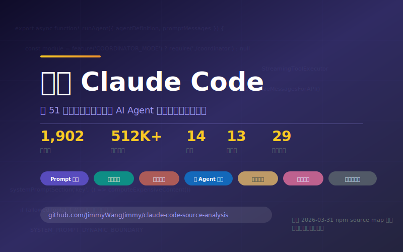

# 拆解 Claude Code

---

### 三种读法

**拿来就用** → 直接翻 [附录：一键复制配置集](chapters/14-copy-paste-configs.md)，复制粘贴立刻生效

**日常提效** → 从 [第 1 章：高效使用手册](chapters/01-power-user-guide.md) 开始，快捷键、隐藏参数、权限配置

**系统学习** → 看 [导读](chapters/00-guide.md) 了解全书结构，按顺序读完 14 章

---

**GitHub** → [github.com/JimmyWangJimmy/claude-code-source-analysis](https://github.com/JimmyWangJimmy/claude-code-source-analysis) — Star 支持一下

---

### 源码出处

本书分析基于 2026 年 3 月 31 日通过 npm source map 泄露的 Claude Code TypeScript 源码（约 1,902 个文件 / 512,000 行）。原始泄露经 [@Fried_rice](https://x.com/Fried_rice/status/2038894956459290963) 公开披露。源码存档由第三方维护：[instructkr/claw-code](https://github.com/instructkr/claw-code)（本书不提供源码，仅做分析引用）。

本书仅用于教育与安全研究。原始源码版权归 Anthropic 所有。
