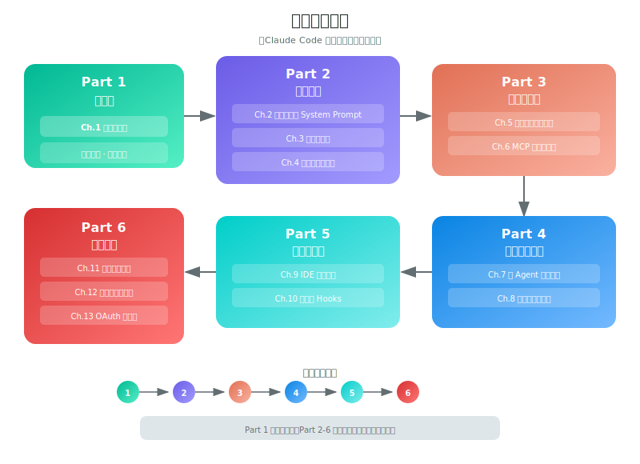

# 导读

**想直接上手？** 跳到 [附录：一键复制配置集](14-copy-paste-configs.md) — settings.json / CLAUDE.md / 环境变量 / Hook 配方 / 初始化脚本，复制粘贴立刻生效。

**想对照源码读？** 源码存档由第三方维护：[instructkr/claw-code](https://github.com/instructkr/claw-code)（~1,902 文件 / 512K 行 TypeScript）。

---

## 全书结构

---

## 阅读路线

### 先上手

从最实用的开始——快捷键、隐藏 CLI 参数、权限配置模板、Hook 自动化。不需要理解架构就能用。

| 章节 | 内容 | 适合谁 |
|------|------|--------|
| [01 - 高效使用手册](01-power-user-guide.md) | 隐藏参数、快捷键、权限白名单、Hook 配置模板、环境变量 | 所有 Claude Code 用户 |

### 核心架构

从入口到输出的完整链路。

| 章节 | 内容 | 能学到什么 |
|------|------|-------------|
| [02 - 技术栈总览](02-overview.md) | Bun / React+Ink / Commander.js / Zod / ripgrep 的选型理由 | 为什么选这些技术 |
| [03 - 整体架构](03-architecture.md) | main.tsx → QueryEngine → query.ts → API → Tools 的调用链 | 请求从头到尾怎么走 |
| [04 - System Prompt 工程](04-system-prompt.md) | 动态组装、7 大策略、优先级系统、正反示例 | 怎么写好 Agent 的 prompt |

### 工具与安全

40+ 工具怎么设计的，6 层权限怎么防住危险操作。

| 章节 | 内容 | 能学到什么 |
|------|------|-------------|
| [05 - 工具系统](05-tool-system.md) | BashTool 161KB 实现、AgentTool 235KB、工具结果大小管理 | 怎么设计 Agent 工具 |
| [06 - 权限与安全系统](06-permission-security.md) | 6 层决策链、Bash AST 分析、ML 分类器、权限疲劳检测 | 怎么做 Agent 安全 |

### 智能体与记忆

四种多 Agent 模式的完整实现，和跨会话记忆的三级架构。

| 章节 | 内容 | 能学到什么 |
|------|------|-------------|
| [07 - 多智能体协作](07-multi-agent.md) | Subagent / Fork / Teammate / Coordinator 四种模式 | 多 Agent 怎么协作 |
| [08 - 记忆系统与上下文管理](08-memory-context.md) | MEMORY.md、压缩策略、Token 预算、Git 状态快照 | 怎么管理 Agent 记忆 |

### 集成与扩展

IDE 桥接的双向通信、40+ Feature Flags 揭示的未发布功能。

| 章节 | 内容 | 能学到什么 |
|------|------|-------------|
| [09 - IDE 桥接与远程控制](09-bridge-ide.md) | WebSocket/SSE/轮询降级、4 层认证、32 并发会话 | IDE 集成怎么做 |
| [10 - 隐藏功能与未发布特性](10-hidden-features.md) | PROACTIVE / VOICE / ULTRATHINK / BUDDY 等 40+ flags | 未来方向是什么 |

### 深度专题

从源码提炼的工程模式、多 Agent 设计方法论、可直接行动的清单。

| 章节 | 内容 | 能学到什么 |
|------|------|-------------|
| [11 - 关键设计模式](11-design-patterns.md) | 15 个模式：Feature Flag 死代码消除、Fork Cache 共享、流式工具执行 | 工程上怎么做 |
| [12 - 多 Agent 设计启示录](12-multi-agent-design-lessons.md) | 14 条设计启示 + 隔离矩阵 + 防递归 + 检查清单 | 构建多 Agent 系统的方法论 |
| [13 - 可行动洞察](13-actionable-insights.md) | 29 条分 7 类的行动建议：Prompt / 架构 / 安全 / 性能 / 记忆 | 具体该做什么 |

---

## 数字一览

| 指标 | 数值 |
|------|------|
| 源文件数 | ~1,902 |
| 代码行数 | 512,000+ |
| 工具实现 | 40+ |
| 斜杠命令 | 60+ |
| Feature Flags | 40+ |
| SVG 架构图 | 13 张 |

## 怎么读

**赶时间：** 读 [第 1 章](01-power-user-guide.md)（使用技巧）和 [第 13 章](13-actionable-insights.md)（行动清单）。

**做 AI Agent：** 重点读 [第 4 章](04-system-prompt.md)（Prompt 策略）、[第 6 章](06-permission-security.md)（安全）、[第 12 章](12-multi-agent-design-lessons.md)（多 Agent 设计）。

**通读全书：** 按顺序，第 1 章打底，后面逐层深入。
